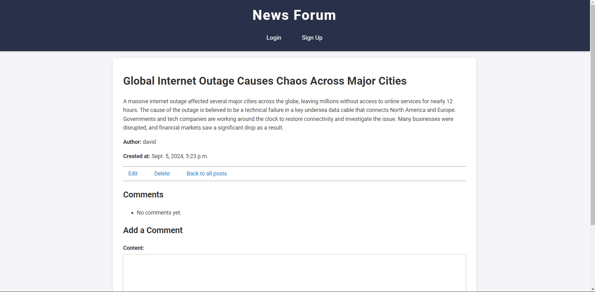

# News Forum

- [News Forum](#news-forum)
  * [Introduction & Overview](#introduction---overview)
    + [Features](#features)
    + [Screenshots](#screenshots)
    + [Article Page](#article-page)
    + [Home Page](#home-page)
    + [Login Page](#login-page)
    + [Installation](#installation)
    + [Wireframes & Design Process](#wireframes---design-process)
      - [Design Process](#design-process)
      - [Wireframes](#wireframes)
        * [Article Page](#article-page-1)
        * [Home Page](#home-page-1)
        * [Login Page](#login-page-1)
        * [Register Page](#register-page)
    + [Usage](#usage)
  * [Technologies Used](#technologies-used)
  * [Development Process](#development-process)
  * [Security Enhancements](#security-enhancements)
  * [Testing](#testing)
    + [Unit Testing](#unit-testing)
    + [Manual Testing](#manual-testing)
      - [User Authentication:](#user-authentication-)
      - [Post and Comment Management:](#post-and-comment-management-)
      - [Responsive Design:](#responsive-design-)
    + [Bugs and Unresolved Issues](#bugs-and-unresolved-issues)
      - [Password Reset Functionality:](#password-reset-functionality-)
    + [Validator Testing](#validator-testing)
      - [HTML/CSS Validation:](#html-css-validation-)
      - [Python Validation:](#python-validation-)
    + [Running Tests Locally](#running-tests-locally)
  * [Deployment](#deployment)
    + [Steps for Deployment on Heroku:](#steps-for-deployment-on-heroku-)
    + [Additional Notes:](#additional-notes-)
  * [Credits & Acknowledgments](#credits---acknowledgments)
    + [Acknowledgements](#acknowledgements)

<small><i><a href='http://ecotrust-canada.github.io/markdown-toc/'>Table of contents generated with markdown-toc</a></i></small>

## Introduction & Overview

News Forum is a web application built with Django, designed for users to create, read, update, and delete posts, as well as to comment on posts. The project demonstrates the application of Python programming concepts and Django’s Model-View-Template (MVT) architecture. The platform is suitable for users who enjoy sharing and discussing news topics in a community setting.

You can view the live application [here](https://news-forum-e420302f60a9.herokuapp.com/).

### Features

- **User Authentication**: 
  - Users can sign up, log in, and log out. This is essential for managing user accounts and ensuring that only authenticated users can create posts or comment.
  
- **CRUD Operations for Posts and Comments**: 
  - Authenticated users can create, read, update, and delete their own posts and comments. This allows users to interact with the content in a dynamic way, encouraging discussion and collaboration.
  
- **Category Management**: 
  - Posts can be categorized under specific topics, making it easier for users to browse and find content relevant to their interests.
  
- **Responsive Design**: 
  - The platform is optimized for both desktop and mobile devices, providing a seamless experience across different screen sizes.
  
- **Flash Messages**: 
  - Users receive real-time feedback on their actions (e.g., successful post creation, errors, etc.), which improves the usability of the site.

---

### Screenshots

### Article Page
- Fullscreen: 
- Mid-screen: 
- Small-screen: 

### Home Page
- Fullscreen: 
- Mid-screen: 
- Small-screen: 

### Login Page
- Fullscreen: 
- Mid-screen: 
- Small-screen: 

### Installation

Follow these steps to install and run the project locally:

1. **Clone the Repository**:
   ```bash
   git clone https://github.com/darvid-223/news-forum.git
   cd news-forum
   ```

2. **Create a Virtual Environment**:
   ```bash
   python -m venv venv
   source venv/bin/activate  # On Windows use venv\Scripts\activate
   ```

3. **Install Dependencies**:
    ```bash
    pip install -r requirements.txt
    ```

4. **Create a .env File**:
   ```bash
   SECRET_KEY=your-secret-key
   DB_PASSWORD=your-database-password
   EMAIL_HOST_USER=your-email@example.com
   EMAIL_HOST_PASSWORD=your-email-password
   ```

5. **Apply Migrations**:
   ```bash
   python manage.py migrate
   ```

6. **Create a Superuser (optional)**:
   ```bash
   python manage.py createsuperuser
   ```

7. **Run the Development Server:**:
   ```bash
   python manage.py runserver
   ```

8. **Collect Static Files:**:
   ```bash
   python manage.py collectstatic
   ```

### Wireframes & Design Process

The design process for this project followed a user-centered approach, focusing on simplicity, ease of navigation, and responsive design to ensure a seamless experience across different devices.

#### Design Process

1. **Wireframing**:  
   The first step in the design process was creating wireframes for key pages (Article Page, Home Page, Login Page, and Register Page). These wireframes helped visualize the basic layout of the site before development, allowing for clear planning of where elements like navigation, content, and user interactions would be placed.

2. **Responsive Design**:  
   One of the primary goals was to ensure that the layout adapts well to various screen sizes, from large desktop screens to smaller mobile devices. The wireframes reflect this with a focus on how elements like navigation menus, forms, and content blocks should behave on different devices.

3. **Consistency**:  
   Consistent use of fonts, colors, and layouts was emphasized to ensure that users would have a cohesive experience across all pages. The design keeps a clean look with simple navigation, making it easy for users to access and interact with posts.

4. **User Flow**:  
   The wireframes aimed to make the user flow intuitive, with clear calls to action on pages like the Home and Article pages. The Login and Register pages were designed to be straightforward, with minimal distractions, allowing users to quickly sign up or log in to interact with the platform.

5. **Feedback and Iteration**:  
   The initial wireframes were revised based on feedback to improve usability and accessibility. For example, button placements and font sizes were adjusted to improve navigation on smaller screens.

#### Wireframes

Below are the wireframes created during the design phase:

##### Article Page
- 

##### Home Page
- 

##### Login Page
- 

##### Register Page
- 

### Usage

After installing and setting up the project, users can interact with the platform through the following features:

1. **User Authentication**:
   - Users can register, log in, and log out.
   - Only authenticated users can create, edit, or delete posts and comments.

2. **Creating a Post**:
   - Once logged in, users can create a post by navigating to the "Create Post" button.
   - Fill in the required fields (Title, Content, and Category) and click "Save" to submit the post.

3. **Viewing Posts**:
   - The home page displays a list of all posts. Clicking on a post title will take the user to the detailed view of that post.
   - Users can also filter posts by category to view posts on specific topics.

4. **Commenting on Posts**:
   - At the bottom of each post's detail page, users can add comments.
   - Only the author of a comment can edit or delete it.

5. **Editing or Deleting a Post**:
   - Users can edit or delete their posts from the post detail page by clicking the "Edit" or "Delete" buttons.

6. **Responsive Design**:
   - The application is fully responsive, ensuring that the user interface adapts seamlessly to different screen sizes. You can test it by resizing your browser or viewing it on mobile devices.

Here are the steps to use the application:

1. **Start the Development Server**:
   - If running the project locally, ensure that the development server is running:
   ```bash
   python manage.py runserver
   ```

2. **Access the Application**:
   - Open a web browser and navigate to `http://127.0.0.1:8000/` to view the application locally.
   - For the live version, visit: [News Forum Live Application](https://news-forum-e420302f60a9.herokuapp.com/).

## Technologies Used

The following technologies, frameworks, and tools were used in the development of this project:

1. **Python**: The primary programming language used for backend logic and managing data.
   
2. **Django**: A high-level Python web framework that handles the Model-View-Template (MVT) architecture, making it easier to build the dynamic and interactive features of the platform.

3. **PostgreSQL**: A powerful, open-source relational database used for both development and production environments.

4. **HTML/CSS**: Used for structuring the front-end design, ensuring the site is visually appealing and responsive.

5. **Bootstrap**: A CSS framework used to create a mobile-first responsive layout for the website.

6. **JavaScript**: Added functionality such as form validation and improved user interactions on the client side.

7. **Git & GitHub**: Used for version control, enabling regular commits, collaborative development, and hosting the repository.

8. **Heroku**: A cloud platform used for deploying the live version of the application.

9. **Jinja2**: Template engine integrated with Django for rendering dynamic HTML pages.

10. **Font Awesome**: A library for adding scalable vector icons, enhancing the website's UI with icons for navigation and interaction.

## Development Process

The development of the News Forum application followed the **Agile methodology**, which emphasizes iterative development and continuous feedback. This approach allowed for flexibility in adjusting features based on feedback and ensured the project met the intended goals efficiently.

Key components of the Agile process included:

1. **GitHub Issues**:
   - GitHub Issues was used as the primary tool for tracking tasks and managing user stories.
   - Each user story or task was logged as an issue, assigned a priority, and linked to relevant commits for easy tracking and collaboration.

2. **Continuous Integration & Deployment**:
   - The project was continuously integrated into a version control system (Git), with all code being pushed to a GitHub repository.
   - Heroku was used for deployment, ensuring that the live version of the application was updated after each successful merge to the main branch.

3. **Continuous Evaluation**:
   - Since the project timeline was limited, a formal sprint process was not used. Instead, I continuously evaluated the development progress.
   - Regular assessments were made to identify what was working well and what required improvement. This approach allowed for quick adjustments and ensured the project stayed on track.

By following this Agile methodology, the project was developed in a structured yet flexible manner, allowing for consistent progress while accommodating changes as needed.

## Security Enhancements

The News Forum application implements several key security features to ensure the protection of user data and to mitigate common web security vulnerabilities:

1. **Cross-Site Request Forgery (CSRF) Protection**:
   - Django’s built-in CSRF protection has been enabled to prevent unauthorized commands being executed on behalf of an authenticated user.
   - This is especially important in forms where users submit sensitive data, such as login information or comments.

2. **Cross-Site Scripting (XSS) Protection**:
   - By using Django's templating engine, the application automatically escapes potentially harmful HTML or JavaScript, protecting against XSS attacks.
   - User inputs are sanitized before being rendered in the browser.

3. **Secure Cookies**:
   - The application configures session and CSRF cookies to be sent over secure connections (`SESSION_COOKIE_SECURE` and `CSRF_COOKIE_SECURE`), ensuring these cookies are only transmitted via HTTPS in production.

4. **SSL/HTTPS in Production**:
   - When deployed on Heroku, the application enforces HTTPS using Django’s `SECURE_SSL_REDIRECT` setting, which ensures that all traffic is encrypted between the user and the server.
   - This guarantees that sensitive information, such as login credentials, are securely transmitted.
   
5. **Local Development**:
   - For local development, `SECURE_SSL_REDIRECT` and `SESSION_COOKIE_SECURE` are disabled to allow ease of testing without needing HTTPS.
   - This ensures a flexible development environment while keeping security tight in production.

6. **Environment Variables**:
   - Sensitive information such as `SECRET_KEY`, database credentials, and email settings are stored securely in environment variables and not hardcoded into the project.
   - This protects these values from being exposed in the version control system.

By implementing these security measures, the News Forum application ensures that user data is protected, both in local development and in production environments on Heroku.

## Testing

### Unit Testing

The News Forum application includes unit tests to verify the functionality of models, views, and forms. These tests are essential to ensure that the core features, such as post creation, comment functionality, and user authentication, work as intended.

To run the unit tests, use the following command:
   ```bash
   python manage.py test
   ```

### Manual Testing

In addition to unit tests, the following manual tests were conducted:

#### User Authentication:
- Verified that users can successfully sign up, log in, and log out.
- Ensured that only authenticated users can create posts or leave comments.

#### Post and Comment Management:
- Tested creating, editing, and deleting posts and comments.
- Ensured that only the author of a post or comment can edit or delete it.

#### Responsive Design:
- Tested the application across different screen sizes (desktop, tablet, mobile) to ensure it remains fully functional and visually consistent.

### Bugs and Unresolved Issues

#### Password Reset Functionality:
- The password reset feature is currently not functioning as expected. Although the application attempts to send reset emails through Gmail’s SMTP service, there is an unresolved issue related to SMTP authentication with Google’s service.
- The error encountered is likely due to incorrect or missing configuration of an app-specific password for the email account in use. Google may block access due to its security settings.
- This issue is still being investigated, and users are unable to reset their passwords at this time.

### Validator Testing

#### HTML/CSS Validation:
- The HTML and CSS code was validated using [W3C Validator](https://validator.w3.org/) to ensure compliance with web standards.

#### Python Validation:
- The Python code was validated against PEP8 standards using `flake8` to ensure proper code formatting and consistency.

### Running Tests Locally

To test the application locally, follow these steps:

1. **Ensure all dependencies are installed**:
   ```bash
   pip install -r requirements.txt
   ```

2. **Run the Django development server to manually test functionality**:
   ```bash
   python manage.py runserver
   ```

3. **For unit tests, execute the following**:
   ```bash
   python manage.py test
   ```

By running these tests, you can ensure that the application functions correctly in both development and production environments.

## Deployment

The News Forum application is deployed on [Heroku](https://www.heroku.com/) for easy access and scalability. Below are the steps to deploy the application to a production environment.

### Steps for Deployment on Heroku:

1. **Create a Heroku Account**:
   - If you don’t have an account, sign up at [Heroku's website](https://www.heroku.com/).

2. **Install Heroku CLI**:
   - Download and install the [Heroku CLI](https://devcenter.heroku.com/articles/heroku-cli) for your operating system.

3. **Login to Heroku**:
   - Open your terminal and login using the Heroku CLI:
   ```bash
   heroku login
   ```

4. **Create a New Heroku App**:
   - Inside the project directory, create a new Heroku app:
   ```bash
   heroku create
   ```

5. **Set Environment Variables**:
   - Set your environment variables such as `SECRET_KEY`, `DEBUG`, `DATABASE_URL`, and email credentials for sending password reset emails:
   ```bash
   heroku config:set SECRET_KEY=<your-secret-key>
   heroku config:set DEBUG=False
   heroku config:set DATABASE_URL=<your-database-url>
   heroku config:set EMAIL_HOST_USER=<your-email>
   heroku config:set EMAIL_HOST_PASSWORD=<your-email-password>
   ```

6. **Configure Buildpacks**:
   - Heroku automatically detects the Python buildpack, but ensure it's set:
   ```bash
   heroku buildpacks:set heroku/python
   ```

7. **Push the Code to Heroku**:
   - Commit any changes and push your code to the Heroku master branch:
   ```bash
   git add .
   git commit -m "Deploying application to Heroku"
   git push heroku main
   ```

8. **Run Migrations**:
   - Run the database migrations to set up your tables:
   ```bash
   heroku run python manage.py migrate
   ```

9. **Collect Static Files**:
   - Collect static files for your app:
   ```bash
   heroku run python manage.py collectstatic --noinput
   ```

10. **Ensure Secure Settings**:
    - Verify that the app is configured with the proper security settings for production:
    - `DEBUG` should be set to `False`.
    - `SESSION_COOKIE_SECURE`, `CSRF_COOKIE_SECURE`, and `SECURE_SSL_REDIRECT` should all be enabled for secure cookies and HTTPS redirection.

11. **Check the App**:
    - Open the deployed app in your browser:
    ```bash
    heroku open
    ```

### Additional Notes:

- **Database**: Heroku uses `DATABASE_URL` for the PostgreSQL database. Make sure your local development database settings are different from the production settings, as Heroku automatically configures this in production.
  
- **Debug Mode**: Ensure `DEBUG=False` in production to prevent exposing sensitive information.

- **Environment Variables**: All sensitive information like `SECRET_KEY`, `DATABASE_URL`, and email credentials must be configured using environment variables.

- **Heroku Logs**:
   - If there are any issues after deployment, you can check the Heroku logs for debugging:
   ```bash
   heroku logs --tail
   ```

Following these steps will allow you to deploy the Django News Forum application successfully to Heroku.

## License

This project is created for educational purposes and personal use. The code and materials in this project are free to explore and learn from, but are not intended for commercial use. If you wish to use any part of this project for your own work, please ensure it is for educational purposes and provide proper attribution.

## Credits & Acknowledgments

### Acknowledgements

- Special thanks to my friend Lucas Behrendt, whose feedback and tips from his experience in the same course were immensely helpful.
- Special thanks to [Udemy's 100 Days of Code: The Complete Python Pro Bootcamp for 2023](https://www.udemy.com/course/100-days-of-code/) for providing comprehensive lessons on Python and object-oriented programming, which significantly contributed to the development of this project.
This project was developed with the assistance of OpenAI's ChatGPT in the following areas:
- **Fictional Articles**: ChatGPT was used to generate fictional news articles used as sample posts for demonstrating the application's functionality. 
- **Code Validation**: ChatGPT helped validate the syntax and logic of the code.
- **Spelling and Grammar Checks**: Assisted in checking and correcting spelling and grammar in the documentation and code comments.
- **Translations**: Provided translations for multilingual support in the documentation.
- **Coding Advice**: Offered suggestions and advice on coding practices and problem-solving approaches.
- **Content Generation**: Assisted in generating fictional content for the posts displayed on the site.
- **Real-Time Troubleshooting**: Supported real-time debugging and troubleshooting during the development process.

Special thanks to [OpenAI's ChatGPT](https://openai.com/) for its invaluable support in refining the content and functionality of this project.
